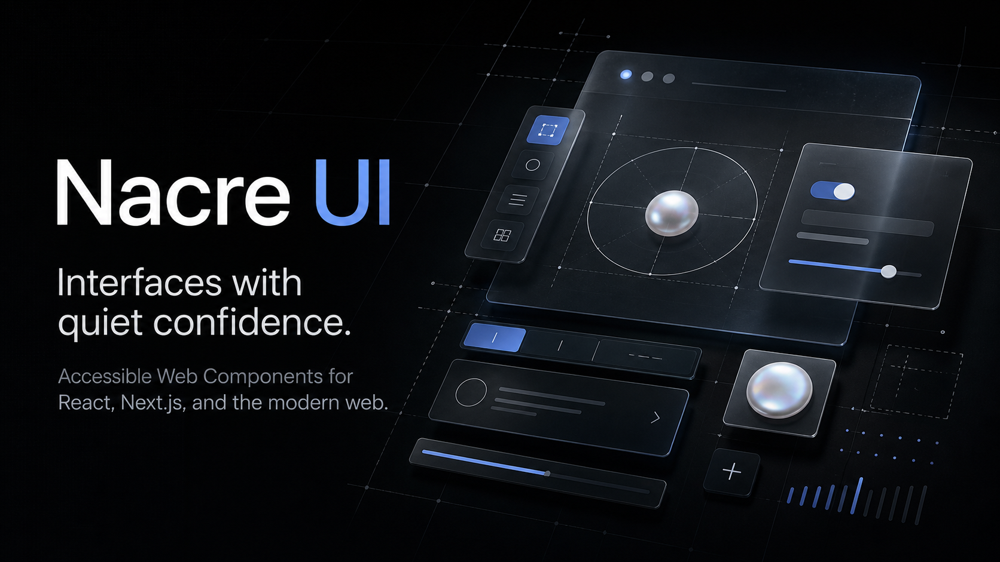

# Nacre UI

A source-based React component collection focused on expressive interaction,
careful motion, and practical accessibility.



> [!IMPORTANT]
> Nacre UI is currently in pre-release development. The component catalogue,
> source registry, and CLI package are being prepared together for the first
> public tag.

## What is included

- A live catalogue with configurable component previews.
- React components for actions, loaders, text and motion, interactions, and
  backgrounds.
- Light and dark appearances.
- Reduced-motion, keyboard, and focus behavior where each interaction needs it.
- A source-copying CLI with overwrite protection and dependency detection.
- A Vinext documentation site with dedicated OpenAI Sites/Cloudflare and Nitro/Vercel build paths.

## Add a component

```bash
npx @nacre-ui/cli@latest add folio-arc-carousel
```

The CLI copies the selected TSX, CSS module, and shared utilities into the
current project. Run `npx @nacre-ui/cli@latest list` to see every available
component.

## Run locally

Requirements:

- Node.js 22.13 or newer
- npm

```bash
npm install
npm run dev
```

The development server prints its local URL when it starts.

## Quality checks

```bash
npm run format:check
npm run lint
npm run typecheck
npm run build
```

Run all checks together with:

```bash
npm run check
```

## Project structure

```text
app/                 Landing page and component documentation
components/ui/       Component implementations and component styles
hooks/               Shared React hooks
lib/                 Shared utilities
packages/cli/        Source registry builder, installer CLI, and tests
public/              Static brand and social-preview assets
.github/             Contribution forms, templates, and CI
```

## Distribution status

The documentation app remains private and is never published to npm. The npm
release contains only `@nacre-ui/cli`, which builds its registry from the
reviewed component source in this repository.

See [Release readiness](docs/RELEASE_READINESS.md) for the remaining work and
the checks required before publishing packages.

## Contributing

Read [CONTRIBUTING.md](CONTRIBUTING.md) before opening a pull request. Component
ideas should use the component-request issue form so requirements and references
remain visible to the community.

## License

Nacre UI is available under the [MIT License](LICENSE).
